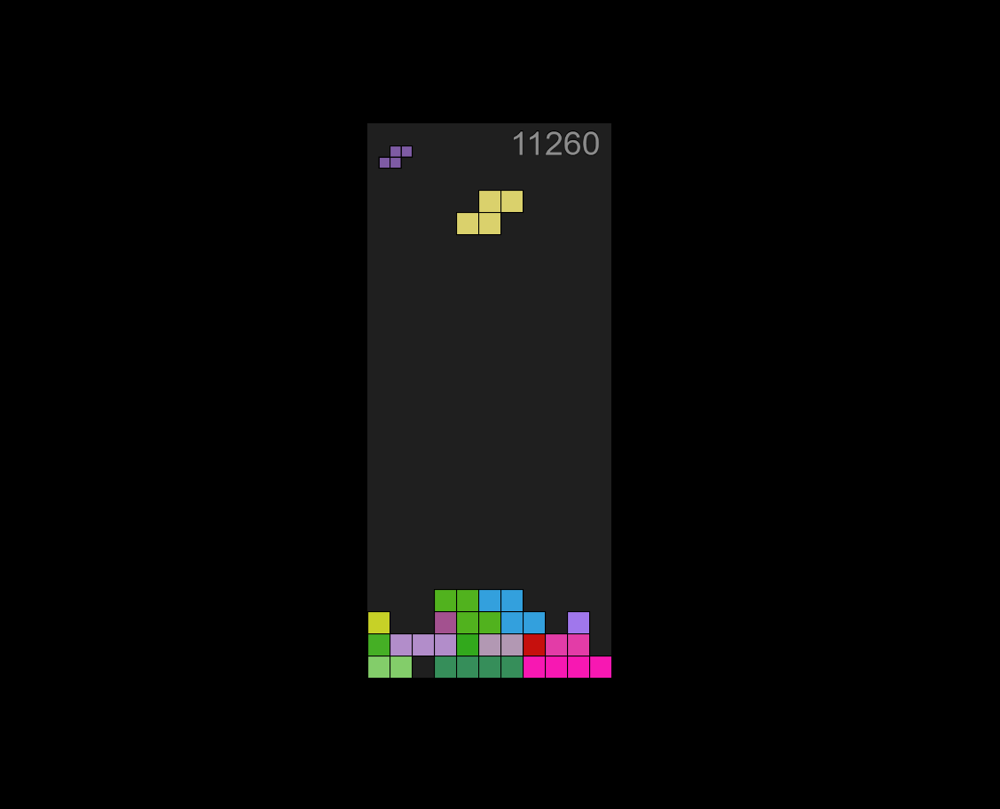

# Tetris

*Created in 2017* 
A clone of the puzzle game created by Alexey Pajitnov in 1984. 
The project is web based and written in `javascript` and `html`. 
It uses [p5.js](https://p5js.org/) for the game objects and the game rendering.  
For `html` manipulation it uses the [jquery](https://jquery.com/) library.

# How to run
You simply open the [index.html](./index.html) file in your browser.
Or you run a simple http server in the root folder with the command `npm start`. 
If you run the web server it will keep the high scores in a scores.txt file.

# Controls
`arrow up` rotate the piece. 
`arrow down` move the piece. 
`arrow left/right` move the piece to the left/right. 
`space bar` let the piece fall down. 
`h` toggle aid by seeing where the piece is going to fall. 
`a` toggle AI, if enabled the computer will play for you. 
`p` pause the game
